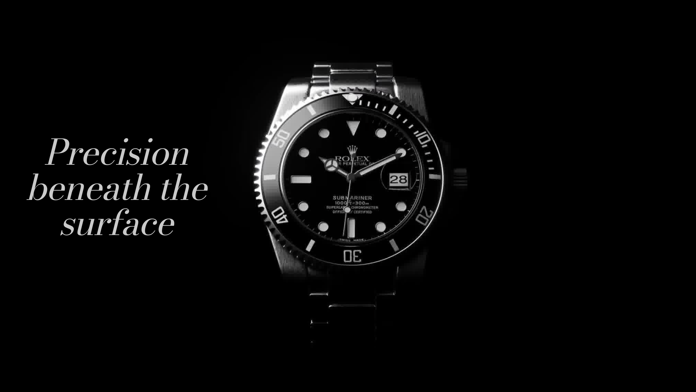

# Rolex Oyster Perpetual - Digital Experience

A premium, scroll-driven landing page dedicated to the Rolex Submariner. This project focuses on high-end typography, a minimalist dark aesthetic, and immersive image sequence animations to reflect the precision and heritage of the Oyster Perpetual.

## Preview

## Features

- **Immersive Animations:** Smooth scroll-based image sequences.
- **Luxury Typography:** Utilizes elegant font pairings (Bodoni, Garamond, Inter).
- **Responsive Design:** Optimized for a seamless experience across devices.
- **Modern Tech Stack:** Built with Next.js and Tailwind CSS.

## Reference

- [Rolex Submariner 2022 Black | Blender 3d Product Animation](https://www.youtube.com/watch?v=L1JoUErVauw)

## How to Improve

### Performance & Load Time
- **Image Sequence Optimization:** Convert high-resolution image sequences to modern formats like WebP or AVIF to reduce file size without losing quality.
- **Edge Caching:** Deploy on a global CDN to ensure assets are served from the closest location to the user.

### Features & UX
- **Interactive Hotspots:** Add clickable details on the watch to reveal technical specifications or heritage stories.
- **Refined Easing:** Fine-tune GSAP or Framer Motion easing curves for even smoother scroll transitions.
- **Dynamic Theming:** Implement subtle theme shifts (e.g., dial color changes) based on user interaction or time of day.
